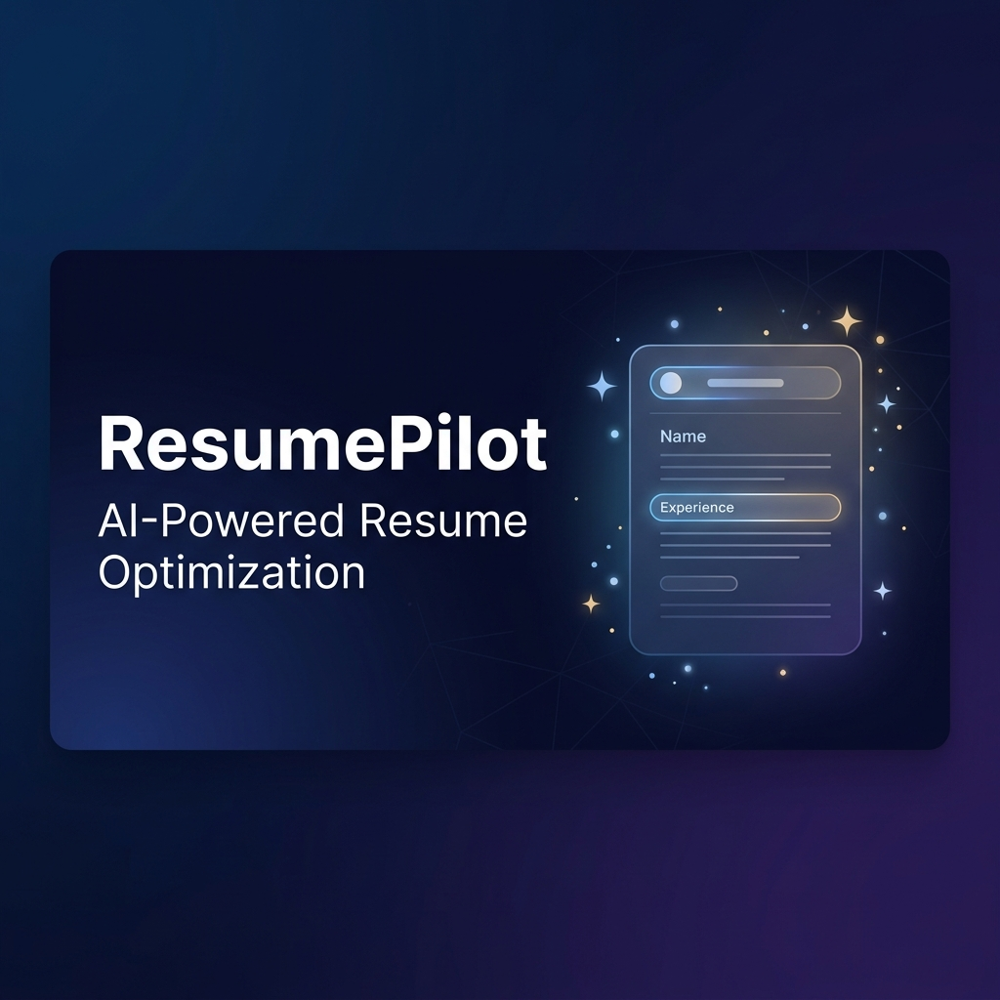

# ParserProof ✨

AI-powered resume optimization platform that helps job seekers land more interviews.



## Features

- 🎯 **ATS Optimization** — AI rewrites your resume to beat applicant tracking systems
- 📊 **ATS Score** — See your compatibility score before you apply
- 🔍 **Keyword Analysis** — Know exactly which keywords match and which are missing
- 📝 **Cover Letters** — Auto-generated cover letters tailored to each job
- 💬 **Interview Prep** — Get likely interview questions with answer hints
- 📈 **Skill Gap Analysis** — Identify gaps and get actionable improvement suggestions
- 💳 **Razorpay Payments** — Secure payment processing with UPI, cards, and more

## Tech Stack

- **Framework**: Next.js 14 (App Router)
- **Database**: PostgreSQL (Neon)
- **ORM**: Prisma
- **Auth**: NextAuth.js (JWT)
- **AI**: Groq API (LLM)
- **Payments**: Razorpay
- **Styling**: Vanilla CSS (custom design system)

## Getting Started

### Prerequisites
- Node.js >= 18
- A [Neon](https://neon.tech) database (free)
- A [Groq](https://console.groq.com) API key (free)
- A [Razorpay](https://dashboard.razorpay.com) account

### Setup

1. Clone the repo:
   ```bash
   git clone https://github.com/your-username/parser-proof.git
   cd parser-proof
   ```

2. Install dependencies:
   ```bash
   npm install
   ```

3. Copy environment variables:
   ```bash
   cp .env.example .env.local
   ```
   Fill in your API keys in `.env.local`.

4. Push database schema:
   ```bash
   npx prisma db push
   ```

5. Run the dev server:
   ```bash
   npm run dev
   ```

6. Open [http://localhost:3000](http://localhost:3000)

## Deployment

### Vercel (Recommended)

1. Push to GitHub
2. Import project on [vercel.com](https://vercel.com)
3. Add environment variables in Vercel dashboard
4. Deploy!

## License

Private — All rights reserved.
